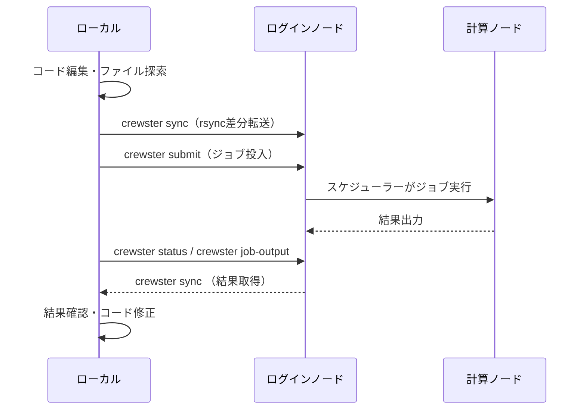

:::message

2026-06-07更新: パッケージ名・コマンド名を`crewster`に変更しました（旧名`hpc`）。

:::

## スパコンでコーディングエージェントを動かすとどうなるか

先日、スパコンのログインノードでCodexを起動したらノードがハングして複数ユーザーに影響が出た、という事例が話題になりました。

<https://zenn.dev/chizuchizu/articles/a991c61ff0d073>

詳細な原因は記事を参照していただきたいですが、プロセスがLustreストレージの応答待ちでハングするなどの現象が報告されています。

通常、スパコンのログインノードで高負荷プロセスを動かすことは推奨されません。
スパコンでの開発は、手元でコードを書いて、`rsync`で送って、`ssh`して`sbatch`でジョブ投入して、結果を`cat`して...というサイクルの繰り返しです。
`rsync`のオプション、ジョブスクリプトの記述、`module load`の手順など、毎回ちゃんと書くのはめんどくさいです。
エージェントにも同じサイクルを回させれば、スパコン上で直接動かす必要はありません。
ということでこのサイクルをまとめたcrewsterというCLIツールを作りました。

<https://github.com/ultimatile/crewster>

## crewster: ローカルで考えて、リモートで計算する

やることはシンプルです。

**コーディングエージェントはローカルで動かし、スパコンには計算だけを投げる。**



ファイルの探索やコード編集はローカルファイルシステムで行い、`rsync`で差分同期してからジョブを投入します。
スパコンの典型的な開発サイクルをワンストップでカバーするrsync + Slurmのラッパーです。

既存のSlurmジョブ投入自動化ツールとしては[submitit](https://github.com/facebookincubator/submitit)が有名ですが、Python限定です。
また、[Snakemake](https://github.com/snakemake/snakemake)などのワークフローエンジンはDAG定義や依存関係の解決まで行いますが、開発・テスト段階では大がかりすぎます。
crewsterは「コードを送って、ジョブを投げて、結果を見る」という手作業をCLIにまとめただけのハンディなツールで、言語を問わず使えます。

## インストール

```bash
# ワンショット実行
uvx --from git+https://github.com/ultimatile/crewster crewster

# 永続インストール
uv tool install git+https://github.com/ultimatile/crewster
```

## 基本ワークフロー

### 1. プロジェクトの初期化

```bash
crewster init
```

`crewster.toml`が生成されます。クラスタの接続情報と環境設定を記述します。

```toml:crewster.toml
[cluster]
host = "myhpc"                    # ~/.ssh/configのホスト名
workdir = "/scratch/user/myproj"  # リモートの作業ディレクトリ
scheduler = "slurm"               # "slurm" or "pjm"

[env]
modules = ["gcc/12.2.0", "cuda/12.2"]

[sync]
ignore = ["crewster.toml", ".git"]

[slurm.options]
partition = "gpu"
time = "02:00:00"
gpus = 1
```

### 2. ファイルの同期

```bash
crewster sync              # 双方向同期（push → pull）
crewster sync --dry-run    # プレビュー
crewster sync --push       # pushのみ（ローカル → リモート）
```

rsyncベースでチェックサム比較がデフォルトです。
`crewster.toml`の`[sync] ignore`で除外パターンを指定できます。

### 3. ログインノードでのセットアップ

パッケージインストールなどインターネットアクセスが必要な操作は、スケジューラーを介さずログインノードで直接実行します。

```bash
crewster exec "pip install -r requirements.txt"
crewster exec "julia -e 'using Pkg; Pkg.instantiate()'"
```

`[env]`セクションの`module load`等は自動適用されます。

### 4. ジョブの投入

```bash
crewster submit "python train.py"
crewster submit --script run.sh --wait  # スクリプト投入＋完了待ち
```

`--wait`をつけるとジョブ完了までポーリングします。
コーディングエージェントと組み合わせると、投入→待機→結果確認→コード修正のループを自動で回せます。

### 5. 結果の確認

```bash
crewster status 12345678       # ジョブステータス
crewster job-output 12345678   # 標準出力
crewster job-output -e 12345678  # 標準エラー
```

### コーディングエージェントからの利用例

実際にClaude Codeから使うと、こんなフローになります。

```
> Aのバグを修正して。テストはクラスター上で実行して。
> コードの共有とジョブ投入はcrewsterコマンドを使って。

Claude Code:
  1. コードを読んでバグを修正
  2. crewster sync                              # 修正をクラスタに同期
  3. crewster submit "pytest tests/" --wait     # テストを投入して待つ
  4. crewster job-output <job_id>               # 結果を確認
  5. （FAILED...）修正を追加
  6. crewster sync && crewster submit ... --wait     # 再投入
  7. crewster job-output <job_id>               # PASSED → 完了
```

ローカルでコードを編集し、スパコンでは計算だけが走ります。

その他コマンドやオプションに関しては`crewster --help`や[README](https://github.com/ultimatile/crewster/blob/main/README.md)を参照してください。

なお、crewsterリポジトリにはClaude Code向けの[スキルファイル](https://docs.anthropic.com/en/docs/claude-code/skills)（`.claude/skills/crewster/SKILL.md`）が同梱されています。
プロジェクトに配置するだけで、CLIの使い方やワークフローをClaude Codeが自動的に把握し、上記のようなフローを自然言語で指示できるようになります。
人間がオプションを覚える必要はありません。

## おわりに

Anthropicが最近公開したブログ[Long-running Claude for scientific computing](https://www.anthropic.com/research/long-running-Claude)では、Claude Codeを直接スパコンの計算ノード上で48時間動かして科学計算コードを自律開発させる事例が紹介されています。

Claude Codeの推論はAnthropicのサーバーで行われるため、計算ノードからインターネットへのアクセスが必要です。
通常のHPCクラスタではそのような構成になっていません。
この事例で使われているPittsburgh Supercomputing CenterのBridges-2は、インターネットアクセスが可能な構成なのかもしれません。

一般的なスパコンでこれを真似しようとすると、ログインノードでコーディングエージェントを動かすことになり、冒頭の事例のようにノードをハングさせるリスクがあります。

crewsterはエージェントをローカルに留め、スパコンへの操作をrsyncとssh越しのコマンド実行に限定します。
スパコンの運用ポリシーに反さないよう設計しており、他のユーザーへの影響も小さくなります。
計算ノードのネットワーク制限が緩和されるまでは、「ローカルで考えて、リモートで計算する」が現実的な解だと考えています。
