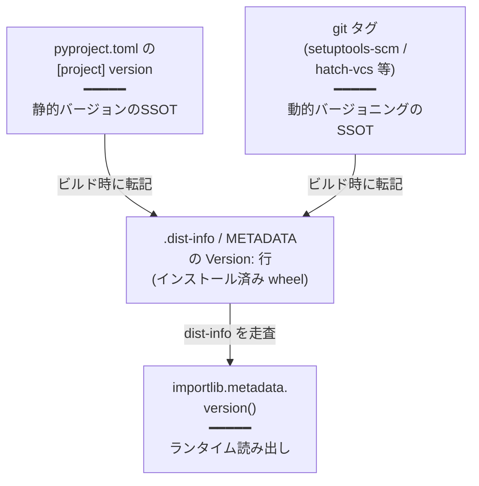

## TL;DR

- 静的バージョンを使う構成では`pyproject.toml`の`project.version`が[信頼できる唯一の情報源(SSOT)](https://ja.wikipedia.org/wiki/%E4%BF%A1%E9%A0%BC%E3%81%A7%E3%81%8D%E3%82%8B%E5%94%AF%E4%B8%80%E3%81%AE%E6%83%85%E5%A0%B1%E6%BA%90)。ランタイムの参照先はインストール済みdistメタデータで、`importlib.metadata.version("dist-name")`で読む。動的バージョニング([`setuptools-scm`]()等)を使う場合はSSOTがgitタグ等に移るが、ランタイムの読み方は同じ。
- 実装法:
  - [Click](https://github.com/pallets/click): `@click.version_option(None, "-V", "--version", package_name="dist-name")`
  - [Typer](https://github.com/fastapi/typer): `is_eager=True`なコールバックで`metadata.version("dist-name")`を`print` → `typer.Exit()`
  - [argparse](https://docs.python.org/3/library/argparse.html): `parser.add_argument("-V", "--version", action="version", version=f"%(prog)s {metadata.version('dist-name')}")`
- `metadata.version`に渡すのは**distribution name** (`pyproject.toml`の`[project] name`)で、**import name**ではない。両者がハイフン/アンダースコアやプレフィックスで一致しない構成があるので要注意。
- フォールバック(`PackageNotFoundError`時に`pyproject.toml`を直接読む)はuvワークフローでは基本踏まれない。デフォルト不要、必要になったら足せばよい。

## 前提: バージョンのSSOTの所在



ランタイムで参照されるのはインストール済みwheelに展開された`<dist>-<ver>.dist-info/METADATA`です。
SSOTは静的バージョン構成なら`pyproject.toml`の`project.version`、動的バージョニング構成ならgitタグ等に移りますが、いずれの場合もビルド時に最終確定値が`METADATA`に焼かれます。
CLI側はこの`importlib.metadata.version()`さえ呼べばよく、上流の戦略には依存しません。`importlib.metadata`は標準ライブラリで追加依存ゼロです。

:::details 手元で確認する(静的バージョン)

`metadata.distribution(...)`が返す`PathDistribution`の`_path`属性が、参照中の`.dist-info`ディレクトリの絶対パスです。`mypkg`を`uv tool install`済み(または`uv sync`済み)の状態で、次を実行します。

```python
from importlib import metadata

d = metadata.distribution("mypkg")
print(d._path)
# → /…/.venv/lib/python3.12/site-packages/mypkg-0.5.0.dist-info

print(metadata.version("mypkg"))
# → 0.5.0

print(d.read_text("METADATA").splitlines()[:3])
# → ['Metadata-Version: 2.4', 'Name: mypkg', 'Version: 0.5.0']
```

`metadata.version()`の戻り値と`_path/METADATA`の`Version:`行が一致すること、`_path`が`<dist>-<ver>.dist-info`の命名パターンであることが実測できます。

:::

### distribution名とimport名の食い違いに注意

`metadata.version(...)`に渡すのはdistribution name(`pyproject.toml`の`[project] name`、つまりPyPIに上がる名前/ `pip install <これ>`で書く名前)を指し、`import`時に使うimport nameとは別物です。

- 有名な食い違い例:
  - `Pillow` (dist) / `PIL` (import) は`metadata.version("Pillow")`が正解。
  - `scikit-learn` (dist) / `sklearn` (import) は`metadata.version("scikit-learn")`が正解。
  - `beautifulsoup4` (dist) / `bs4` (import)、`PyYAML` (dist) / `yaml` (import)、`opencv-python` (dist) / `cv2` (import)なども同様。
- 自前プロジェクトでも`pyproject.toml`で`[project] name = "foo-cli"`と書きながらパッケージは`src/foo/`のように別名にしているなら同じ罠が踏めます。
- 一致するかどうかをハードコードしたくない場合でも、`__package__`から逆引きするよりdistribution nameを文字列リテラルで持つほうが事故を減らせます(リネームしたら気づくため)。

両者を実行時に対応付けたい場合は`importlib.metadata.packages_distributions()`が使えますが、これは「あるimport nameがどのdistに属するか」を返すマップなので、本来dist nameが分かっているならわざわざ使う必要はありません。

## Click: `@click.version_option`

完全委譲です。
`package_name`にdist nameを渡すと、内部で`importlib.metadata.version()`を引いてくれます。

```python
import click

@click.group()
@click.version_option(None, "-V", "--version", package_name="mypkg")
def cli():
    ...
```

第一引数`None`は「明示的なバージョン文字列を渡さない= `package_name`から自動解決する」の意です。短いエイリアスが要らなければ`@click.version_option(package_name="mypkg")`だけで`--version`が生えます(`-V`は付きません)。

出力フォーマットはデフォルトで`%(prog)s, version %(version)s`形式です。`%(prog)s`は**Clickのprog名**(起動時のコマンド名/ `argv[0]`のbasename、または`@click.command(name=...)`での明示指定)に展開されるもので、`package_name`とは別物です。たとえばdistribution nameが`mypkg`でも、ユーザが`mypkg -V`で叩けば`mypkg, version 1.1.0`、シンボリックリンクや別名entry point経由で`foo -V`と叩けば`foo, version 1.1.0`になります。

差し替えたければ`message=`を渡します。

```python
@click.version_option(None, "-V", "--version", package_name="mypkg", message="%(prog)s %(version)s")
```

利用可能な変数は`%(prog)s` / `%(version)s` / `%(package)s`で、`%(package)s`のほうが`package_name`の値に展開されます。
Clickを採用しているならこれが最小・最良です。
`importlib.metadata`呼び出しすら明示的に書かないで済みます。

## Typer: コールバックパターン

TyperはClickの薄いラッパですが、Clickの`version_option`相当のショートカットは無いので自前で書きます。

```python
import typer
from importlib import metadata

app = typer.Typer()


def _version_callback(value: bool):
    if not value:
        return
    print(f"myapp {metadata.version('myapp')}")
    raise typer.Exit()


@app.callback()
def app_callback(
    version: bool = typer.Option(
        False,
        "--version",
        "-V",
        callback=_version_callback,
        is_eager=True,
        help="Print version and exit",
    ),
):
    pass
```

### `is_eager=True`を忘れない

これが地味に重要です。`is_eager=True`を付けないとTyper/Clickは他のオプションのパース・バリデーションを先に進めてしまい、サブコマンドの必須引数が無い場合に「`--version`だけ叩いたのにusageエラーで死ぬ」現象が出ます。
eagerオプションは他のパースより先に発火するので、コールバックの中で`typer.Exit()`すれば残りのバリデーションをスキップして即終了できます。

### `@app.callback()`内に同居させる

別のeagerオプション(`--skill`のようなhiddenオプション等)が既にあるなら、同じ`app_callback`の引数に`version`を足す形が無難です。
Typerの`@app.callback()`は1つしか持てないので、複数のeagerオプションを並べる場所がここしかありません。

## argparse: `action="version"`

argparse組み込みのアクションを使います。`version=`に文字列を渡すだけで`--version`時に出力して`SystemExit(0)`してくれます。

```python
import argparse
from importlib import metadata

parser = argparse.ArgumentParser(prog="mytool")
parser.add_argument(
    "-V",
    "--version",
    action="version",
    version=f"%(prog)s {metadata.version('mytool')}",
)
```

- `%(prog)s`は`parser`の`prog`に展開されます(argparseの`version=`はprintf-styleフォーマットを通します)。
- `metadata.version()`の呼び出しは**parser構築時**に走るので、起動コストに乗ります。重くはありませんが、起動時間が極端にシビアな用途(補完スクリプト等)では遅延評価したくなるかもしれません。
その場合は`action="version"`を捨てて、自前で`--version`を`parse_args`後に分岐する必要があります(あまり旨味はありません)。

## 基本的に`__version__`はエクスポートしない

`__init__.py`に`__version__ = "x.y.z"`を置く慣習は古くから根強いですが、アプリ専用(CLIとして叩かれるだけ)なら不要です。
`--version`の出力は`importlib.metadata.version()`で完結し、`__version__`属性に頼る必要はありません。

### 例外: ライブラリとして叩かれる可能性がある場合

ライブラリとして配って、利用者が`pkg.__version__`を参照するユースケースがあるなら付けておく価値があります。
その場合も値はハードコードせず、SSOTである`metadata.version()`から引きます。

```python
# pkg/__init__.py
from importlib import metadata
__version__ = metadata.version("dist-name")
```

ハードコード(`__version__ = "0.1.0"`)はSSOT原則違反なので避けます。

## フォールバックはuvワークフローでは基本不要

`importlib.metadata.version()`はdist-infoが無いと`PackageNotFoundError`を投げます。
これに備えて`pyproject.toml`を直接パースする二段フォールバックを書くこともできます。

```python
def _read_version() -> str:
    from importlib import metadata
    try:
        return metadata.version("dist-name")
    except metadata.PackageNotFoundError:
        pass
    import tomllib
    from pathlib import Path
    try:
        pyproject = Path(__file__).resolve().parent.parent / "pyproject.toml"
        with pyproject.open("rb") as f:
            return tomllib.load(f)["project"]["version"]
    except (OSError, KeyError, tomllib.TOMLDecodeError):
        return "unknown"
```

ただし`PackageNotFoundError`が発生するのは要するに「インタプリタ環境にdist-infoが存在しない」ときだけです。uvベースのワークフローでは以下のようになります。

|操作| dist-info | `metadata.version()` |
|---|---|---|
| `uv tool install .` |専用venvに作られる| ✓ |
| `uv sync` / `uv pip install -e .` | editableでも生成される| ✓ |
| `uv run <cmd>` |自動sync経由で生成済み| ✓ |
| `PYTHONPATH=src python -m pkg` (install無し) |無い| ✗ |
|ソースを別venvにコピーして直叩き|無い| ✗ |

下2行のような「installステップを踏まずにsource treeから直接実行する」運用を想定するならフォールバックを書く価値はありますが、`uv tool install`で配るのを主用途とするなら出番がありません。
デフォルトはフォールバック無しでよく、必要になった時点で`_read_version()`を足せば十分です。

なお`pyproject.toml`の場所を「ファイルの親の親」のような相対パス決め打ちで取りに行くのは、パッケージ構造を変えたときに静かに壊れます。
フォールバックを入れるなら「パスが見つからない/ TOMLパース失敗/ `project.version`キー欠落」を全部`except`で潰して`"unknown"`に逃がす設計とします(上のサンプルはその形です)。

:::details `src`レイアウトはinstallを強制する(パッケージ構成側の選択肢)

上の表で`PackageNotFoundError`が出る下2行は、いずれも「パッケージはimportできるのにdist-infoが無い」状態です。
この状態に意図せず到達してしまうのは、パッケージをリポジトリ直下に置くflatレイアウト特有の事情です。
Pythonインタプリタはカレントディレクトリを`sys.path`の先頭に入れるため、リポジトリルートで`python -m pkg`と叩くと、install前のソースツリーがそのままimportされ、dist-infoだけ無い状態でコードに到達します。

これを構造的に防ぐのが`src`レイアウト(パッケージを`src/pkg/`に置く配置)です。
パッケージを`src/`に隔離するとリポジトリルートからは見えなくなり、install済みコピーを経由しないとimportできなくなります。
[Python Packaging User Guideの "src layout vs flat layout"](https://packaging.python.org/en/latest/discussions/src-layout-vs-flat-layout/)も、srcレイアウトはコードを動かすのにinstallを要求するが、flatレイアウトは要求しないと述べています。

> The src layout requires installation of the project to be able to run its code, and the flat layout does not.

同じ趣旨を早くに指摘した[Hynek Schlawackの "Testing & Packaging" (2015)](https://hynek.me/articles/testing-packaging/)も、テストがinstall後の姿に対して走らない問題を挙げ、コードを「import不能な別ディレクトリ」に隔離するよう勧めています。

> isolating the code into a separate – _un-importable_ – directory might be a good idea

srcレイアウトの主目的はリソース同梱漏れなどの梱包バグを早期に発見することですが、その副産物として「install前のソースツリー直叩き」という`PackageNotFoundError`経路を塞ぎます。

これで上の表の`PYTHONPATH=src python -m pkg`という書き方の意味もはっきりします。
srcレイアウトでは素の`python -m pkg`は`src/`がパス上に存在せず、importが失敗して`PackageNotFoundError`以前で止まります。
`PYTHONPATH=src`はその`src/`をimportパスに載せ直し、「import可能だがinstallされていない」状態を意図的に再現しています。
srcレイアウトはこのエラーを不能化するわけではなく、偶発的な経路を消すだけです。
`PYTHONPATH`注入で意図的に再現すれば、同じ状態へ到達します。

実装の選択肢は「フォールバックを足すかどうか」の二択とは限らず、「`src`レイアウトに移して偶発的な経路を構造的に消す」という選択肢もあります。
ただしこれは梱包の正しさという独自の動機で採否を決めるパッケージ構成の判断で、`--version`のクラッシュ防止は副産物にすぎません。
「未installのソースツリー実行をサポート対象とするか」という運用判断の代わりにはなりません。

:::

## 動的バージョニングを使っている場合

`setuptools-scm`/`hatch-vcs`等でgitタグからバージョンを生成する構成でも、ビルド後のdist-infoには確定バージョンが焼かれています。
ランタイムからの読み方は`importlib.metadata.version()`で全く同じで、CLI側の実装はバージョン管理戦略に依存しません。

`pyproject.toml`の`[project]`に`dynamic = ["version"]`が入っているプロジェクトだと「TOMLを直接パース」フォールバックは`project.version`が無くて失敗します。
動的バージョニング採用時はフォールバックの存在意義が更に薄くなるので、`metadata.version()`のみで割り切るのが妥当です。

:::details 手元で確認する(setuptools-scm)
最小プロジェクトに`setuptools-scm`を仕込み、`v1.2.3`タグを切ってeditable install すると、静的バージョンの場合とまったく同じ形のdist-infoが生まれます。

```toml
# pyproject.toml
[build-system]
requires = ["setuptools>=64", "setuptools-scm>=8"]
build-backend = "setuptools.build_meta"

[project]
name = "scmverify"
dynamic = ["version"]

[tool.setuptools_scm]
```

```sh
git init -q && git add -A && git commit -q -m init && git tag v1.2.3
uv venv -q && uv pip install -q -e .
uv run --no-project python -c "
from importlib import metadata
d = metadata.distribution('scmverify')
print(d._path)                # → /…/.venv/lib/python3.11/site-packages/scmverify-1.2.3.dist-info
print(metadata.version('scmverify'))   # → 1.2.3
print(d.read_text('METADATA').splitlines()[:3])
# → ['Metadata-Version: 2.4', 'Name: scmverify', 'Version: 1.2.3']
"
```

`_path`の命名(`<dist>-<ver>.dist-info`)も`METADATA`の`Version:`行のレイアウトも静的構成と完全一致します。違うのは「`Version:`に書かれる文字列を誰がいつ決めるか」だけです。`pyproject.toml`側に`version`キーが存在しないので、TOML直読フォールバックが本当に使い物にならないことも同じ手順で確認できます。

:::

## まとめ

- 静的バージョン構成のSSOTは`pyproject.toml`の`project.version`。動的バージョニング構成ではgitタグ等がSSOTになる。いずれもランタイムは`importlib.metadata.version("dist-name")`で`<dist>-<ver>.dist-info/METADATA`を読む。
- Clickは`@click.version_option(package_name=...)`で完全委譲。
- Typerは`is_eager=True`なcallback。
- argparseは`action="version"`。
- distribution nameとimport nameの食い違いに注意。
- フォールバックはuvワークフローでは基本不要。動的バージョニング採用時は尚更。
- ライブラリ用途でなければ`__version__`属性も不要。

## むすび: エージェントの提案をレビューする人間のためのチェックリスト

ここに書いた内容は、コーディングエージェント(Claude Code等)はすでに全部知っています。`--version`をエミットする実装を頼めば、フレームワークに応じた正しいコードが返ってきますし、`_read_version()`のような二段フォールバックも当然のように提案してくれます。

問題は、エージェントが安全側に倒した提案をしてきたとき(典型的にはフォールバック付きの実装)、人間側が「自分の運用前提だとそのフォールバックは不要だ」と即断するための判断材料を持っているかどうかです。`importlib.metadata.version()`が踏むコードパスと、踏まないコードパス(`PackageNotFoundError`経路)が運用上どういう条件で出るかを言語化しておかないと、毎回エージェントの保険を漫然と受け入れて、要らない分岐が増えていきます。

この記事は、エージェント向けではなく、エージェントの提案にレビューを返す人間側のチェックリストとして書いています。uv前提で配るアプリならフォールバック無しでよい、という結論をすぐ出せるようにするのが主目的です。
