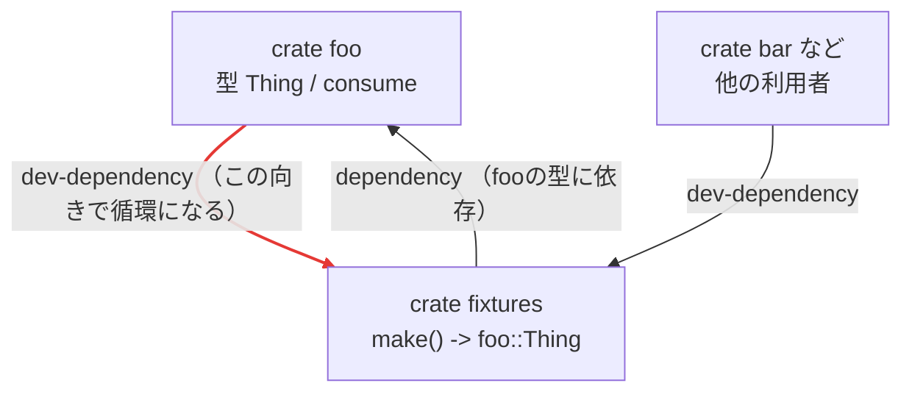
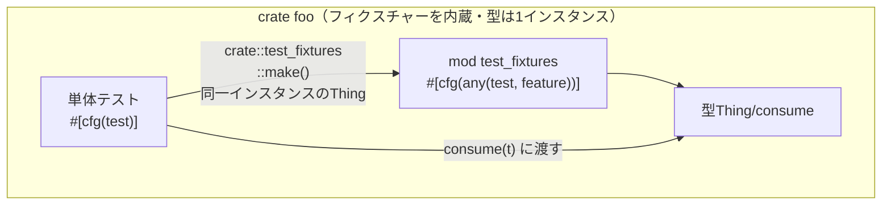

:::message

## TL;DR

- 別クレートに切り出したフィクスチャーを元クレートがdev-dependencyにすると、元クレート自身の`#[cfg(test)]`を用いた単体テストがコンパイルできなくなる。
- 原因は`cargo test`が元クレートを「`cfg(test)`あり版」と「なし版」の2インスタンスでビルドし、両者の同名の型が別物になること。
- `cargo build`も統合テスト（`tests/*.rs`）も通るので「動く」と誤認しやすい。壊れるのは元クレート自身のin-lib単体テスト経路だけ（統合テストなら元クレートを1インスタンスしかリンクせず無事）。
- **要点: 元クレートの型を組み立てて元クレート自身のin-lib単体テストで使うフィクスチャーは、外部クレートに切り出せない。** 切り出すと`foo ⇄ fixtures`のdev-dependency循環が必要になり、この循環ゆえに単体テストビルドは別インスタンスの型をリンクするため。対処は元クレート内に`#[cfg(any(test, feature = "..."))] pub mod`で置くこと。元クレートに依存しない（循環にならない）フィクスチャー、たとえば統合テスト専用や下位クレートのシナリオ用のものは切り出せる。

:::

## はじめに

あるクレートのテスト用ヘルパー（フィクスチャー）を複数のクレートで使い回したくなることがあります。つい独立したクレートに切り出して共有したくなりますが、元クレートの型に依存するフィクスチャーでこれをやると、元クレート自身の`#[cfg(test)]`単体テストだけがコンパイルできなくなります。`cargo build`も統合テストも通るのに単体テストだけが落ちるので、原因がわかりづらいです。

具体的には、`foo`の型`Thing`を組み立てるフィクスチャー`make() -> Thing`を別クレート`fixtures`に切り出し、型定義のある元クレート`foo`がそれをdev-dependencyに追加した状況です。`fixtures`単体のビルドも`foo`の統合テストも通りましたが、`foo`自身の単体テストだけが`error[E0308]: mismatched types`（`` expected `Thing`, found `foo::Thing` ``）で落ちました。dev-dependencyが循環している（`fixtures`は`foo`に依存し、`foo`は`fixtures`をdev-dependencyにする）ことがヒントですが、循環自体はビルド可能なので、それだけでは原因が見えません。

## 最小再現

### 構成

2クレートのworkspaceで再現します。

```
repro/
├── Cargo.toml
├── foo/
│   ├── Cargo.toml
│   └── src/
│       └── lib.rs
└── fixtures/
    ├── Cargo.toml
    └── src/
        └── lib.rs
```

```toml:Cargo.toml
[workspace]
members = ["foo", "fixtures"]
resolver = "2"
```

```toml:foo/Cargo.toml
[package]
name = "foo"
version = "0.1.0"
edition = "2021"

[dev-dependencies]
fixtures = { path = "../fixtures" }
```

```toml:fixtures/Cargo.toml
[package]
name = "fixtures"
version = "0.1.0"
edition = "2021"

[dependencies]
foo = { path = "../foo" }
```

```rust:foo/src/lib.rs
pub struct Thing(pub i32);

pub fn consume(_t: Thing) {}

#[cfg(test)]
mod tests {
    use super::*;
    #[test]
    fn round_trip() {
        let t = fixtures::make(); // fixtures経由でfooの型を作り
        consume(t);               // foo自身の関数へ戻す
    }
}
```

```rust:fixtures/src/lib.rs
use foo::Thing;

pub fn make() -> Thing {
    Thing(0)
}
```

### 実行結果

```console:terminal
$ cargo build -p foo             # 通る
    Finished `dev` profile [unoptimized + debuginfo] target(s) in 0.41s

$ cargo test -p foo --test it    # 統合テストも通る
     Running tests/it.rs
test from_integration ... ok

$ cargo test -p foo              # 自クレートの 単体テスト が落ちる
error[E0308]: mismatched types
  --> foo/src/lib.rs:11:17
   |
11 |         consume(t);               // foo自身の関数へ戻す
   |         ------- ^ expected `Thing`, found `foo::Thing`
   |         |
   |         arguments to this function are incorrect
   |
note: there are multiple different versions of crate `foo` in the dependency graph
  --> foo/src/lib.rs:1:1
   |
 1 | pub struct Thing(pub i32);
   | ^^^^^^^^^^^^^^^^ this is the expected type
   |
  ::: foo/src/lib.rs:1:1
   |
 1 | pub struct Thing(pub i32);
   | ---------------- this is the found type
```

`` note: there are multiple different versions of crate `foo` ``が核心です。`fixtures::make()`の返す`Thing`と、単体テスト側の`consume`が要求する`Thing`は、別インスタンスの`foo`に由来して食い違います。`` expected `Thing` ``と `` found `foo::Thing` `` が同じ`struct Thing`の定義行（`foo/src/lib.rs:1`）を二重に指しているのが、この「同名だが別物」の状況を端的に表しています。

## なぜ壊れるのか

まず登場人物と依存の向きを整理します。フィクスチャーを別クレート`fixtures`に切り出すと、`fixtures`は`foo`の型を組み立てるので`foo`に依存します。そのうえでその`fixtures`を`foo`自身のテストでも使いたいので、`foo`は`fixtures`をdev-dependencyに持ちます。fixtureをクレートとして共有し、かつ元クレートのテストでも使うという構造上、この`foo ⇄ fixtures`の循環は避けられません。Cargoは通常の（非dev）dependencyの循環は`error: cyclic package dependency`で拒否しますが、dev-dependencyを経由する循環は許容します。`foo`が`fixtures`をdev-dependencyにする構成はCargoとして正当で、ビルドも通ります。問題の所在は循環の有無ではなく、この構成のもとで`cargo test`が`foo`を2インスタンスにビルドし、同名の型が食い違うことにあります。



`bar`のように「`foo`の外側の利用者」が`fixtures`を使う経路には循環がなく、問題は起きません。壊れるのは循環の当事者である`foo`自身のテストだけです。

`cargo test -p foo`は`foo`を2回ビルドします。これはCargoの仕様で、[`cargo test`のドキュメント](https://doc.rust-lang.org/cargo/commands/cargo-test.html)には`--tests`について

> the lib target may be built twice (once as a unittest, and once as a dependency for binaries, integration tests, etc.)

とあります。単体テストバイナリは`foo`を`cfg(test)`付きでコンパイルした「test版」で、dev-dependencyの`fixtures`がリンクするのは`cfg(test)`の付かない「非test版」の`foo`です。

この2つはRustから見ると別クレートで、同名の型も別物として扱われます。`fixtures::make()`が返す`Thing`は非test版`foo`の`Thing`で作られ、それを受け取る単体テスト側の`consume`はテスト版`foo`の`Thing`を要求します。両者の型が同一ではないため`E0308`（mismatched types）になります。エラーの`` note: there are multiple different versions of crate `foo` ``が、この食い違いを名指ししています。

厄介なのは検知のすり抜けです。`fixtures`単体のビルドと`foo`の統合テスト（`tests/*.rs`は`foo`を1インスタンスだけリンクする別クレートなのでミスマッチが起きない）は通ってしまうため、壊れていることに気づきにくいです。壊れるのは「元クレート自身の単体テストが、自分の型を切り出し先クレート経由で受け取る」経路に限られます。

なお、フィクスチャーがトレイト境界を持つ総称型（例えば`make<S: Trait>() -> Thing<S>`）でも同じことが起きます。この場合は非test版の型がtest版の境界を満たせず、エラーが`error[E0277]: trait bound not satisfied`になりますが、原因は同一で「同名でも別インスタンスの型」に由来します。

## 対処法

フィクスチャーは別クレートへ切り出さず、元クレート内にfeature gateで置きます。これで`fixtures`クレートがなくなり、`foo ⇄ fixtures`の循環も消えます。効いているのは循環の除去そのものというより、単体テストがフィクスチャーを同じ`foo`インスタンス内の`crate::test_fixtures`として見る点です。同じインスタンスなので、型が二重化しません。



```rust:foo/src/lib.rs
#[cfg(any(test, feature = "test-fixtures"))]
pub mod test_fixtures; // pub fn make() -> Thing { ... }
```

```toml:foo/Cargo.toml
[features]
test-fixtures = []

[dev-dependencies]
foo = { path = ".", features = ["test-fixtures"] }
```

- `cfg(test)`はそのクレート自身のテストビルドにしか付かず、クレート境界を越えない。だから`foo`自身の単体テストは`test`側から自動で入る。外から使わせるには`test-fixtures` featureを立てる。`any`はこの2経路を束ねている。
- その`test-fixtures`の立て方は2通り。他クレートはdev-dependencyで`foo = { ..., features = ["test-fixtures"] }`。`foo`自身の`tests/*.rs`（別クレート扱い）は自己dev-dependency（上記`[dev-dependencies]`）で有効化する。これで手元の`cargo test`がそのまま通る。
- `resolver = "2"`なら、dev-dependency経由で有効にしたfeatureは通常の`cargo build`に統合されず、feature gateしたフィクスチャーも通常ビルドのコンパイル対象にならない（`cargo test`や`--all-targets`など`tests`を含むビルドでは統合される）。ソースはデフォルトで配布パッケージに同梱され、`test-fixtures`を有効にした利用者から`foo::test_fixtures`が公開APIとして見える。

## まとめ

別クレートに切り出したフィクスチャーを元クレートがdev-dependencyにすると、`cargo test`が元クレートをtest版と非test版の2インスタンスでビルドし、両者の同名の型が食い違うため、元クレート自身の単体テストだけがコンパイルできなくなります。`cargo build`も統合テストも通るぶん気づきにくいです。壊れるのは元クレートの型に依存するフィクスチャーを自身の単体テストへ戻す経路に限られるので、そのフィクスチャーは別クレートにせず、元クレート内に`#[cfg(any(test, feature = "..."))] pub mod`で置き、他クレートからはfeature付きdev-dependencyで使うのが安全です。共有したいだけなら別クレート化は不要で、切り出しの候補になるのは元クレートに依存しないフィクスチャー（循環しないもの）に限られます。`foo`自身の統合テストは、`test-fixtures`付きの自己dev-dependencyを足せば素の`cargo test`で通ります。テスト専用featureなので消費者は通常は触らず、有効化するのはテストを走らせる側だけです。

## 参考

- [cargo test — The Cargo Book](https://doc.rust-lang.org/cargo/commands/cargo-test.html) — `--tests`の項に"the lib target may be built twice"の記述
- [Dev-dependencies — Rust By Example](https://doc.rust-lang.org/rust-by-example/testing/dev_dependencies.html) — dev-dependencyの基本
- [Feature resolver version 2 — The Cargo Book](https://doc.rust-lang.org/cargo/reference/resolver.html#feature-resolver-version-2) — `resolver = "2"`でdev-dependency由来のfeatureが通常ビルドに漏れない
